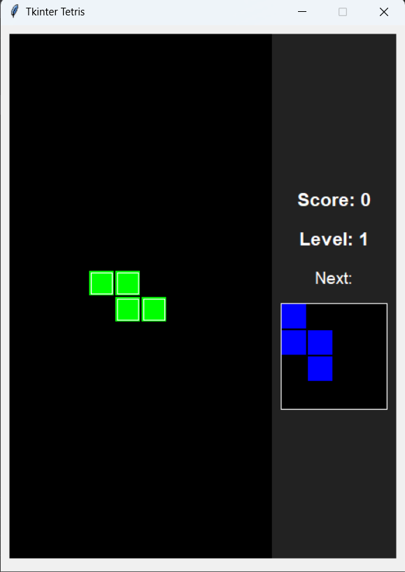

# Tkinter Tetris

## Overview

Tkinter Tetris is a simple implementation of the classic Tetris game built using Python's Tkinter library. It provides a graphical grid where tetrominoes fall, and the player must arrange them to clear lines and score points.

## Features

- 10x20 Tetris grid rendered using a Tkinter `Canvas`.
- Seven standard Tetris pieces: I, J, L, O, S, T, Z, each with distinct colors and rotation states.
- Real-time keyboard controls:
  - Left Arrow: Move piece left.
  - Right Arrow: Move piece right.
  - Down Arrow: Soft drop (faster fall).
  - Up Arrow: Rotate piece.
  - Space: Hard drop (instantly place current piece).
- Next piece preview panel.
- Score and level tracking:
  - Score increases based on number of lines cleared at once and current level.
  - Level increases after clearing a certain number of lines, increasing the falling speed.
- Game over detection and message display.

## Technologies / Tools Used

- Language: Python 3
- GUI Library: Tkinter (standard Python library)
- Other: `random` module from Python standard library

## Installation and Running the Project

1. Ensure Python 3 is installed on your system.
2. Save the game code into a file, for example:
   - `tetris.py`
3. Open a terminal or command prompt in the folder containing `tetris.py`.
4. Run the game with:

## Screenshot

